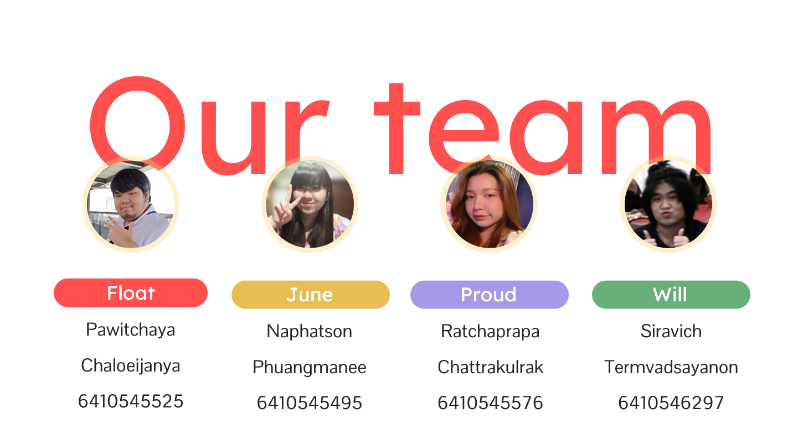

# Goodo: Todo Database Systems Project

Goodo is an todo web application that will help you manage your tasks efficiently and stay on top of your daily activities.

Click [here](https://www.figma.com/file/zpM3jm7CxB16JugElEmODZ/Goodo?node-id=0%3A1&t=lDPIKrgGm6CzKmJw-1 ) for our project mockup.

Click [here](https://drive.google.com/file/d/1D9zg1JRwgTxmQLS8KaHScDqcY5Qw_OJN/view?usp=sharing) for our presentation slide.

## Installation Instructions

Make sure to have the following requisite software:

* Node.js version 18 or greater
* yarn package manager
* Docker

1. Start a MongoDB instance using Docker by executing such command:
```bash
docker run -d -p 27017:27017 --name mongodb mongo:latest
```
**NOTE:** The following command sets default *unsafe* MongoDB instance, to customize check the documentation at Docker Hub.

2. Navigate to the `/backend` and `/frontend` in each directory execute the following command to install Node.js packages.
```bash
yarn
```

3. To start running the backend and frontend services, use two terminal windows or multi-pane terminal emulator (such as `tmux`).
```bash
# start service by:
yarn dev
```
## Authors
